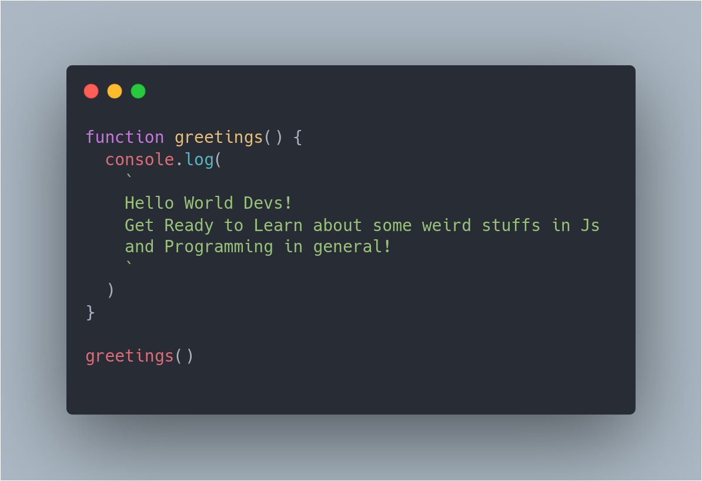

This is my first post on Devline! How exciting 👨🏻‍💻!

I'm sure I'll write a lot more interesting things in the future about web and its technologies.

I will try to explain weird and complex stuff related to Javascript and Typescript using words and code snippets, so stay tuned..

But Just to get Started with Here is a great quote By [Atwood](https://en.wikipedia.org/wiki/Jeff_Atwood) famously referred as Atwood's Law:

> “Any application that can be written in JavaScript,
> will eventually be written in JavaScript.”

