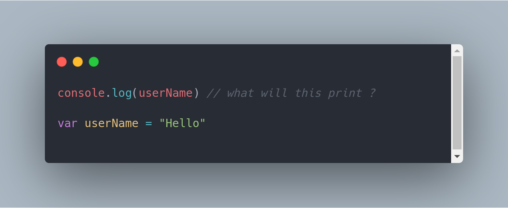
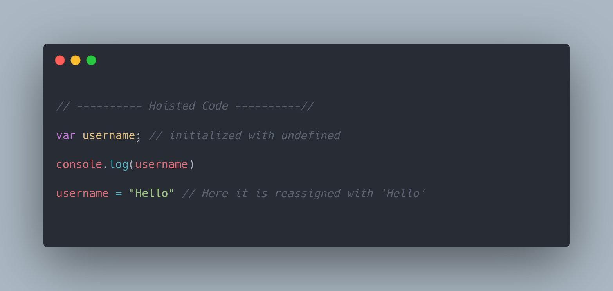

**_Hoisting_** in literal sense, means to raise (pull up) something to the top.
This is exactly what the browser does before executing JS code!

Lets looks at an example and guess what should be the output according to you?

Could you guess the output ?

Will it give any error ?
Or Print the value "Hello" to the console ?

**OUTPUT** :

Okay now what exactly is happening ?
From where did this **_undefined_** came ...
How were we able to use _"username"_ before its declaration?

Confused ?! I won't blame y'all.

Let's decode and see what exactly happens behind the scenes before our code is executed.

### Understanding Hoisting

Hoisting is the process carried out by the browser's engine before executing our code , wherein all the code **declarations** and **functions** are moved towards the top of the file in the global scope.

To put it in simple words, Hoisting refers to the mechanism followed by our browser to **register** all the var and function declarations in the memory before running our script!

What browser does is, that it creates a memory location in RAM and intializes it to value of **_undefined_** to that variable...

This is exactly what happens with our variable username.
The variable declaration is moved upwards and hence we don't get any error and simply print the value with which browser intialized it to (_undefined_).

But why undefined?  
We did initialize our variable with value of "Hello".  
Why didn't it stored _"Hello"_ ?

The simple reason behind this is that Hoisting is not happening during run time.
It is done by the browser before the execution starts.  
But we know the value assigned to username will only be available during the **runtime** after the code execution starts.

Hence it is initialized with **_undefined_** by the browser and thus the output.

### Transformed Hoisted Code

This is how our code is transformed before execution ...

As you can see in our code snippet , that **Hoisting does not move** our entire statement of declaring and intializing of variable (**Important**)

Here it just adds the declaration of the var towards the top.  
Assignment of value is done by the JS runtime as it is executes statement from top to bottom.
Hence if we try to console the value of username variable after the assignment, it will log "_Hello_" to the console

### Hoisting in Functions

Hositing in case of Function declarations are not much different than that of variables.

Instead of intializing the function with **_undefined_** , browser maps the function name to its address and stores it in the memory.

This enables us to **_call_** or **_invoke_** the function even before declaring it, as the reference of the function is available to us even before the execution starts.
This is also referred to as **_"Early Binding"_**

That was all about **_Hoisting_**.

We can see that this mechanism allows us with the flexibility of using our variables / functions before declaring it.

But this can quickly become highly inconvenient to maintain and can lead to all sorts of error and **_ambiguity_** in your code.

Thus it is good to know about Hoisting but one should not indulge into this bad practice of using variables before declaring...

This will help you in improving the quality as well as the readability and thus save you from introducing hell lot of **bugs** in your code.
