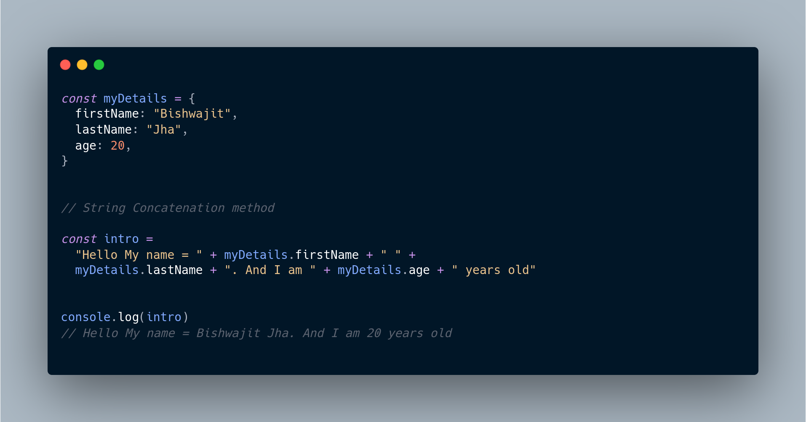
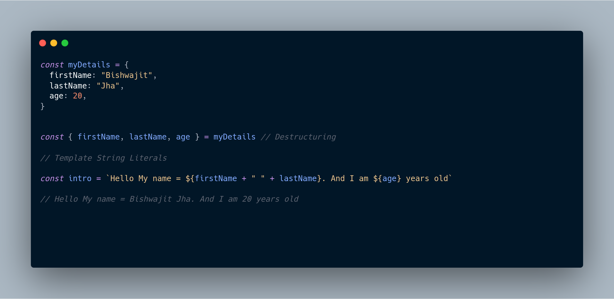
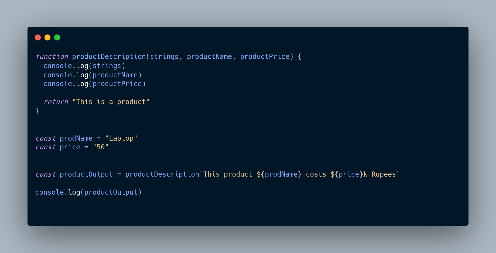
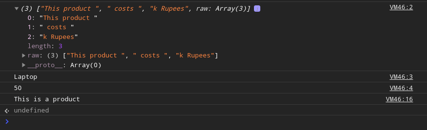
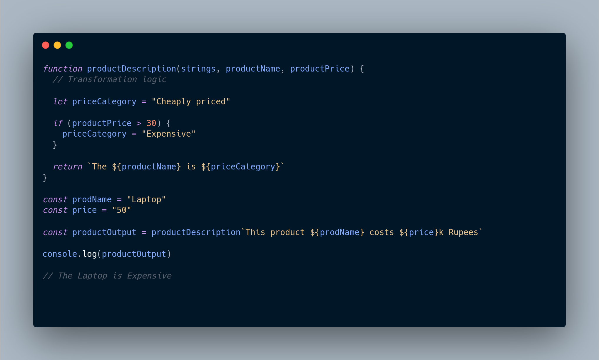

Template Literals was introduced in ES2015 for making string interpolation and
compilation easier and more readable to the programmer

Along with this a very niche and wierd syntax of Tagged Templates was introduced as a supplementary to the former.
Let's see its syntax and explore why and when might we need it in and come across in the projects.

---

## Template Literals

Template Literals are used for binding and injecting some dynamic content in our strings.

It makes uses of (**\`\`**) Back ticks for marking the start of a template string and dynamic code and values can be inserted
by evaluating the expression between ('\${}')

To acknowledge its simplicity and usefulness let us compare it with traditional way of interpolating dynamic values
using **_string concatenation_** ( + )

The above code snippet logs -

**Hello My name = Bishwajit Jha. And I am 20 years old** to the console !

But as you can guess , its very difficult to parse and read this code and makes formatting very cumbersome as we would manually have to take care of whitespaces between the dynamically injected part

This is where Template literals comes to our rescue!

As we can easily make out from the above code snippet, how the above syntax makes the **_injection of dynamic content_** in the string so easy as well as maintains the readability and accessibilty of the code and provides us an elegant way of formatting strings.

Note that, here not only we can inject a value but any expression that evaluates to a string or can be represented in the equivalent string format.

## Tagged Templates

We just saw how we can dynamically inject some data into a string.

Tagged Templates allow us to do exactly the opposite, that is, it allows us to **_extract the data_** dynamically from a template string

The way the tag template works is you simply make a function, and you take the name of the function that you want to run against the string, and you just put the name right in front of the template

Let's deconstruct this above mechanics one by one in the code snippet given below

As we can see this tags it with a function name. What will happen is the browser will run this function, it will provide it with all the information about the string, all the pieces that the person typed, as well as the variables that get passed in.

Whatever we return from this function is what sentence actually is going to be.

#### OUTPUT:

Here we can infer that how the interpolated data was extracted from the tagged string and how it was splitted to segregate the static part of the string from the dynamic one

Now based on this data we can manipulate the string that was passed as a tagged template to our function and returned value of function is then our modified string.

The core logic behind this is to manipulate some dynamic data from the user entered string and carry out that transformation / manipulation logic in the function tagged with the template string

Thus, Here we created a **_custom dynamic description_** for a product based on the price that we extracted from the template literal

### Where do we see it in use ?

If you have prior experience of working with ReactJs you might have come across [Styled components](https://styled-components.com/) for writing custom css for our components

It makes use of Tagged Templates for manipulating the css styles we pass as Template string and generate the Stylesheet object based on it !

So what are you waiting for , Just start exploring more about Tagged Templates and make use of this fantastic **_Next-gen_** ES6 feature in your next project 🤔🙌🏻.

Follow me on twitter for getting updates about new Topics and Posts and feel free to share feedbacks and suggestions !

<!--
**_Hoisting_** in literal sense, means to raise (pull up) something to the top.
This is exactly what the browser does before executing JS code!

Lets looks at an example and guess what should be the output according to you?

Could you guess the output ?

Will it give any error ?
Or Print the value "Hello" to the console ?

**OUTPUT** :

Okay now what exactly is happening ?
From where did this **_undefined_** came ...
How were we able to use _"username"_ before its declaration?

Confused ?! I won't blame y'all.

Let's decode and see what exactly happens behind the scenes before our code is executed.

### Understanding Hoisting

Hoisting is the process carried out by the browser's engine before executing our code , wherein all the code **declarations** and **functions** are moved towards the top of the file in the global scope.

To put it in simple words, Hoisting refers to the mechanism followed by our browser to **register** all the var and function declarations in the memory before running our script!

What browser does is, that it creates a memory location in RAM and intializes it to value of **_undefined_** to that variable...

This is exactly what happens with our variable username.
The variable declaration is moved upwards and hence we don't get any error and simply print the value with which browser intialized it to (_undefined_).

But why undefined?
We did initialize our variable with value of "Hello".
Why didn't it stored _"Hello"_ ?

The simple reason behind this is that Hoisting is not happening during run time.
It is done by the browser before the execution starts.
But we know the value assigned to username will only be available during the **runtime** after the code execution starts.

Hence it is initialized with **_undefined_** by the browser and thus the output.

### Transformed Hoisted Code

This is how our code is transformed before execution ...

As you can see in our code snippet , that **Hoisting does not move** our entire statement of declaring and intializing of variable (**Important**)

Here it just adds the declaration of the var towards the top.
Assignment of value is done by the JS runtime as it is executes statement from top to bottom.
Hence if we try to console the value of username variable after the assignment, it will log "_Hello_" to the console

### Hoisting in Functions

Hositing in case of Function declarations are not much different than that of variables.

Instead of intializing the function with **_undefined_** , browser maps the function name to its address and stores it in the memory.

This enables us to **_call_** or **_invoke_** the function even before declaring it, as the reference of the function is available to us even before the execution starts.
This is also referred to as **_"Early Binding"_**

That was all about **_Hoisting_**.

We can see that this mechanism allows us with the flexibility of using our variables / functions before declaring it.

But this can quickly become highly inconvenient to maintain and can lead to all sorts of error and **_ambiguity_** in your code.

Thus it is good to know about Hoisting but one should not indulge into this bad practice of using variables before declaring...

This will help you in improving the quality as well as the readability and thus save you from introducing hell lot of **bugs** in your code. -->
