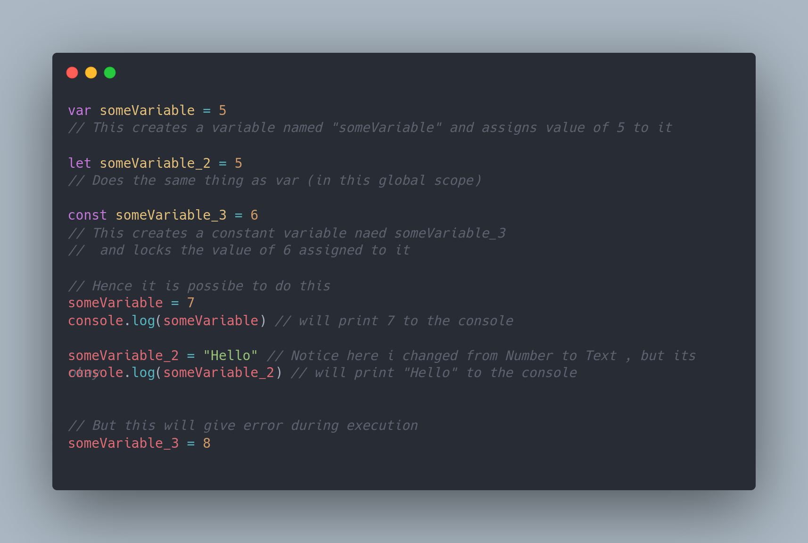
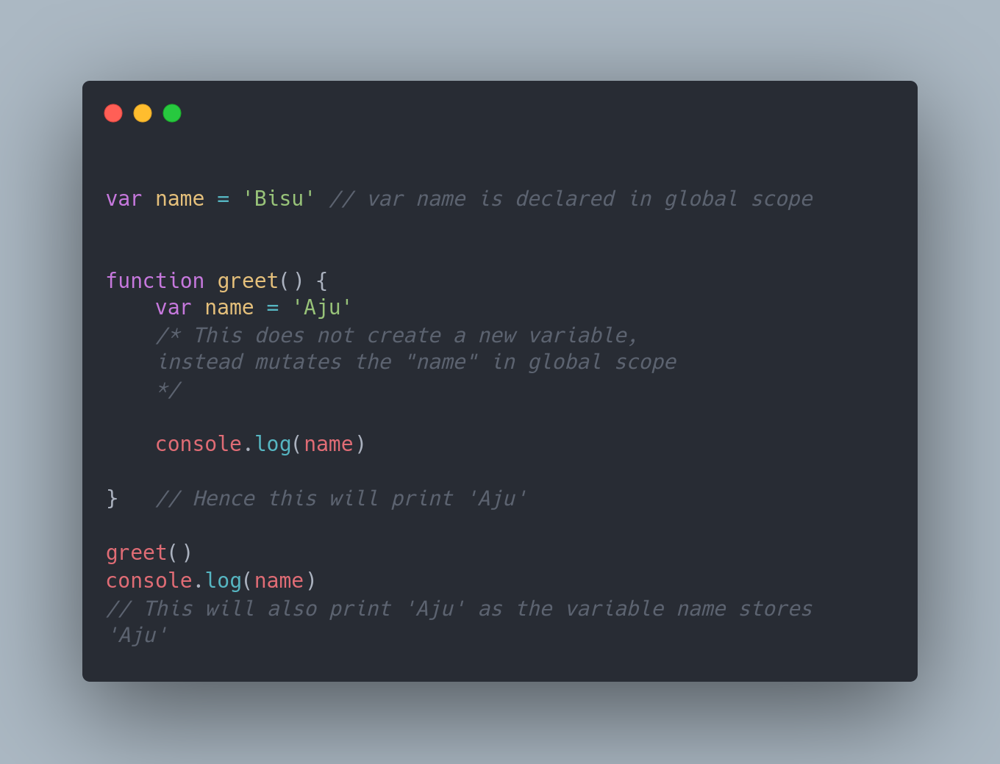

### Let us discuss the Usage

**_var_** and **_let_** are basically used for creating a variable (Whose value can change during runtime!)

**_const_** as the name suggests is short for constant variable (whose value is fixed and won't change during runtime)

**_var_** is available to us from the inception of JS whereas, **_const_** and **_let_** are relatively new feature available to us from ES6(2015) onwards

If you all are familiar with other languages like **(C, C++, Java)** you might notice that while allocating space to the variable we don't specify the Type of value which should be stored in that. This is Because JS is a [weakly Typed](https://en.wikipedia.org/wiki/Strong_and_weak_typing) Dynamic Language which simply means that the variables are not bounded towards a particular type/value (unless u declare it as _const_)

### Difference Between Them

**_let_** and **_const_** for instance have all the properties same except from reassignability.
Interesting Variations can be seen in case of **_let_** and **_var_**.

**_var_** - Global and Function Scope  
**_let_** - Block Scope

**Scope** Basically signifies the access or availability of the variable within particular sections of the code

**Global Scope** refers to the Scope where all the top level code gets executed or registered in memory(in case of Async Events) when that file/module is mounted. The variables declared in this scope is globally accessible from anywhere in your code

**Function Scope** refers to the Area enclosed by the Function Body.
The variables declared in this scope can only be accessible in this body as well as in its nested functions and scopes due to _closure_ (Topic to be discussed in some other post!)

From ES6 onwards a new concept called block level scoping was introduced.

**Block scope** is comprised of any area that is enclosed between curly Braces **{}**
This includes area within **if, switch conditions or for and while** loops!

This feat led to more specificity towards usage and declaration of variables
and thus, overcome the problems that used to arise sometimes due to global scoping...

But Just to get Started with Here is a great quote By [Atwood](https://en.wikipedia.org/wiki/Jeff_Atwood) famously referred as Atwood's Law:

> “Any application that can be written in JavaScript,
> will eventually be written in JavaScript.”

